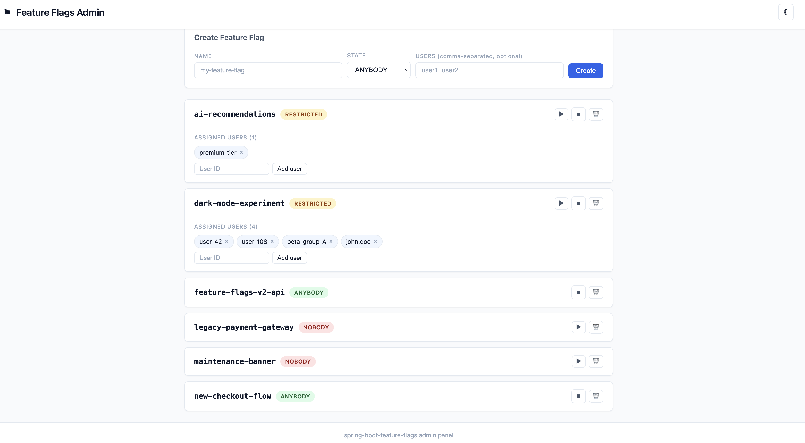

# Spring Boot Feature Flags

A lightweight, production-ready Spring Boot starter for feature flag management. Control application features globally or per user, manage flags at runtime via REST API, and track usage with Micrometer metrics.

[](https://central.sonatype.com/artifact/io.github.orczykowski/spring-boot-feature-flags)
[](https://opensource.org/licenses/MIT)

## Table of Contents

- [Requirements](#requirements)
- [Installation](#installation)
- [Quick Start](#quick-start)
- [Configuration Reference](#configuration-reference)
- [Feature Flag States](#feature-flag-states)
- [Verifying Flags in Code](#verifying-flags-in-code)
- [User Context Provider](#user-context-provider)
- [Storage Backends](#storage-backends)
  - [Property (Default)](#property-default)
  - [JPA](#jpa)
  - [Redis](#redis)
  - [MongoDB](#mongodb)
  - [Custom Storage](#custom-storage)
- [Database Schema (DDL)](#database-schema-ddl)
- [REST APIs](#rest-apis)
  - [Presenter API (Read-Only)](#presenter-api)
  - [Management API (CRUD)](#management-api)
- [Admin Panel](#admin-panel)
- [Metrics](#metrics)
- [Tips and Best Practices](#tips-and-best-practices)
- [Contributing](#contributing)
- [License](#license)

## Requirements

- Java 25+
- Spring Boot 4.0+

## Installation

**Maven:**

```xml
<dependency>
    <groupId>io.github.orczykowski</groupId>
    <artifactId>spring-boot-feature-flags</artifactId>
    <version>2.2.0</version>
</dependency>
```

**Gradle:**

```groovy
implementation 'io.github.orczykowski:spring-boot-feature-flags:2.2.0'
```

Add the library package to your component scan:

```java
@SpringBootApplication(scanBasePackages = {"your.app.package", "io.github.orczykowski"})
```

## Quick Start

1. Enable feature flags in `application.yml`:

```yaml
feature-flags:
  enabled: true

  definitions:
    - name: NEW_CHECKOUT
      enabled: ANYBODY
    - name: DARK_MODE
      enabled: RESTRICTED
      entitledUsers: [user-101, user-202]
    - name: LEGACY_EXPORT
      enabled: NOBODY
```

2. Inject `FeatureFlagVerifier` and check flags:

```java
@Service
public class CheckoutService {

    private final FeatureFlagVerifier featureFlags;

    public CheckoutService(FeatureFlagVerifier featureFlags) {
        this.featureFlags = featureFlags;
    }

    public void checkout() {
        if (featureFlags.verify(new FeatureFlagName("NEW_CHECKOUT"))) {
            // new checkout flow
        } else {
            // legacy checkout flow
        }
    }
}
```

## Configuration Reference

```yaml
feature-flags:
  enabled: true                            # Master switch (required)

  definitions:                             # Feature flag definitions (property storage only)
    - name: FLAG_NAME                      # Unique name (max 120 characters)
      enabled: ANYBODY                     # State: ANYBODY | NOBODY | RESTRICTED
      entitledUsers: [user1, user2]        # Required when state is RESTRICTED

  storage:
    type: property                         # Storage backend: property | jpa | redis | mongodb
    table-name: feature_flags              # Table name (JPA)
    collection-name: feature_flags         # Collection name (Redis/MongoDB)
    assignment-table-name: feature_flag_assignments       # Assignment table (JPA)
    assignment-collection-name: feature_flag_assignments   # Assignment collection (Redis/MongoDB)

  api:
    expose:
      enabled: false                       # Enable read-only presenter API
      path: /feature-flags                 # Custom endpoint path
    manage:
      enabled: false                       # Enable CRUD management API
      path: /manage/feature-flags          # Custom management endpoint path

  admin-panel:
    enabled: false                         # Enable built-in admin panel UI
    path: /feature-flags-admin             # Custom admin panel path

  metrics:
    enabled: false                         # Enable Micrometer metrics
```

| Property | Type | Default | Description |
|----------|------|---------|-------------|
| `feature-flags.enabled` | `boolean` | `false` | Master switch. Must be `true` for any feature to work. |
| `feature-flags.storage.type` | `enum` | `property` | Storage backend: `property`, `jpa`, `redis`, `mongodb`. |
| `feature-flags.storage.table-name` | `string` | `feature_flags` | Table name for JPA backend. |
| `feature-flags.storage.collection-name` | `string` | `feature_flags` | Collection/hash key name for Redis/MongoDB. |
| `feature-flags.storage.assignment-table-name` | `string` | `feature_flag_assignments` | User assignment table name (JPA). |
| `feature-flags.storage.assignment-collection-name` | `string` | `feature_flag_assignments` | User assignment collection/hash key (Redis/MongoDB). |
| `feature-flags.api.expose.enabled` | `boolean` | `false` | Enable the read-only presenter REST endpoint. |
| `feature-flags.api.expose.path` | `string` | `/feature-flags` | Path for the presenter API. |
| `feature-flags.api.manage.enabled` | `boolean` | `false` | Enable the CRUD management REST endpoints. |
| `feature-flags.api.manage.path` | `string` | `/manage/feature-flags` | Path for the management API. |
| `feature-flags.admin-panel.enabled` | `boolean` | `false` | Enable the built-in admin panel UI. Requires management API enabled. |
| `feature-flags.admin-panel.path` | `string` | `/feature-flags-admin` | Path for the admin panel. |
| `feature-flags.metrics.enabled` | `boolean` | `false` | Enable Micrometer metrics. Requires `MeterRegistry` on classpath. |

## Feature Flag States

| State | Behavior |
|-------|----------|
| `ANYBODY` | Enabled for all users, regardless of user context. |
| `NOBODY` | Disabled for everyone. |
| `RESTRICTED` | Enabled only for users assigned to the flag. Requires a [`UserContextProvider`](#user-context-provider) bean. |

## Verifying Flags in Code

Inject `FeatureFlagVerifier` into any Spring-managed component:

```java
boolean isEnabled = featureFlags.verify(new FeatureFlagName("MY_FLAG"));
```

**Behavior:**

- Returns `true` if the flag exists and is enabled (considering user context for `RESTRICTED` flags).
- Returns `false` if the flag does not exist, is `NOBODY`, or the current user is not in the entitled list.
- Publishes metrics for each verification if metrics are enabled.

## User Context Provider

To use `RESTRICTED` flags, implement the `UserContextProvider` functional interface and register it as a Spring bean:

```java
@Bean
public UserContextProvider userContextProvider() {
    return () -> {
        Authentication auth = SecurityContextHolder.getContext().getAuthentication();
        if (auth != null && auth.isAuthenticated()) {
            return Optional.of(new User(auth.getName()));
        }
        return Optional.empty();
    };
}
```

The `User` record accepts both `String` and `Number` identifiers:

```java
new User("user-101")   // String ID
new User(42)           // Numeric ID
```

When no `UserContextProvider` is registered, all flags are evaluated globally (`RESTRICTED` flags will return `false` for every verification).

## Storage Backends

The library supports four storage backends out of the box. Each requires adding the corresponding Spring Boot starter to your classpath.

### Property (Default)

Flags are defined in `application.yml` and stored in-memory. No additional dependencies required.

```yaml
feature-flags:
  enabled: true
  storage:
    type: property
  definitions:
    - name: MY_FLAG
      enabled: ANYBODY
```

> **Note:** Property storage keeps flags in a `ConcurrentHashMap`. Changes made via the management API are lost on restart and not shared across instances.

### JPA

Requires `spring-boot-starter-data-jpa` and a relational database driver on the classpath. The schema is automatically managed by Hibernate.

```yaml
feature-flags:
  enabled: true
  storage:
    type: jpa
```

```xml
<dependency>
    <groupId>org.springframework.boot</groupId>
    <artifactId>spring-boot-starter-data-jpa</artifactId>
</dependency>
```

### Redis

Requires `spring-boot-starter-data-redis`. Flags and assignments are stored as Redis hashes.

```yaml
feature-flags:
  enabled: true
  storage:
    type: redis
```

```xml
<dependency>
    <groupId>org.springframework.boot</groupId>
    <artifactId>spring-boot-starter-data-redis</artifactId>
</dependency>
```

### MongoDB

Requires `spring-boot-starter-data-mongodb`. Flags and assignments are stored as MongoDB documents.

```yaml
feature-flags:
  enabled: true
  storage:
    type: mongodb
```

```xml
<dependency>
    <groupId>org.springframework.boot</groupId>
    <artifactId>spring-boot-starter-data-mongodb</artifactId>
</dependency>
```

### Custom Storage

For read-only verification, implement `FeatureFlagSupplier`:

```java
@Bean
public FeatureFlagSupplier featureFlagSupplier() {
    return new FeatureFlagSupplier() {
        @Override
        public Stream<FeatureFlagDefinition> findAllEnabledFeatureFlags() { /* ... */ }

        @Override
        public Optional<FeatureFlagDefinition> findByName(FeatureFlagName name) { /* ... */ }
    };
}
```

For full CRUD with the management API, implement `FeatureFlagRepository`:

```java
@Bean
public FeatureFlagRepository featureFlagRepository() {
    return new FeatureFlagRepository() {
        @Override
        public FeatureFlagDefinition save(FeatureFlagDefinition definition) { /* ... */ }

        @Override
        public void removeByName(FeatureFlagName flagName) { /* ... */ }

        @Override
        public Stream<FeatureFlagDefinition> findAll() { /* ... */ }

        @Override
        public Stream<FeatureFlagDefinition> findAllEnabledFeatureFlags() { /* ... */ }

        @Override
        public Optional<FeatureFlagDefinition> findByName(FeatureFlagName name) { /* ... */ }
    };
}
```

For user assignment management, implement `FeatureFlagAssignmentRepository`:

```java
@Bean
public FeatureFlagAssignmentRepository featureFlagAssignmentRepository() {
    return new FeatureFlagAssignmentRepository() {
        @Override
        public EntitledUsers findUsersByFlagName(FeatureFlagName flagName) { /* ... */ }

        @Override
        public FeatureFlags findFlagNamesByUser(User user) { /* ... */ }

        @Override
        public boolean isUserAssigned(FeatureFlagName flagName, User user) { /* ... */ }

        @Override
        public void saveAssignments(FeatureFlagName flagName, EntitledUsers users) { /* ... */ }

        @Override
        public void addUser(FeatureFlagName flagName, User user) { /* ... */ }

        @Override
        public void removeUser(FeatureFlagName flagName, User user) { /* ... */ }

        @Override
        public void removeAllByFlagName(FeatureFlagName flagName) { /* ... */ }
    };
}
```

## Database Schema (DDL)

For JPA storage, Hibernate handles schema creation automatically. Below are the schemas for reference.

### PostgreSQL / MySQL

```sql
CREATE TABLE IF NOT EXISTS feature_flags (
    name    VARCHAR(120) PRIMARY KEY,
    enabled VARCHAR(20)  NOT NULL
);

CREATE TABLE IF NOT EXISTS feature_flag_assignments (
    flag_name VARCHAR(120) NOT NULL,
    user_id   VARCHAR(255) NOT NULL,
    PRIMARY KEY (flag_name, user_id)
);
```

### MongoDB

No schema creation required. Documents are created automatically:

**feature_flags collection:**
```json
{
  "_id": "NEW_CHECKOUT",
  "name": "NEW_CHECKOUT",
  "enabled": "ANYBODY"
}
```

**feature_flag_assignments collection:**
```json
{
  "_id": "DARK_MODE",
  "flagName": "DARK_MODE",
  "userIds": ["user-101", "user-202"]
}
```

## REST APIs

### Presenter API

Read-only endpoint returning the names of feature flags enabled for the current user. Only enabled flags are returned to prevent leaking information about unreleased features.

**Enable:**

```yaml
feature-flags:
  enabled: true
  api:
    expose:
      enabled: true
```

#### `GET /feature-flags`

**Response** `200 OK`:

```json
{
  "featureFlags": ["NEW_CHECKOUT", "DARK_MODE"]
}
```

### Management API

CRUD endpoints for administering feature flags at runtime.

**Enable:**

```yaml
feature-flags:
  enabled: true
  api:
    manage:
      enabled: true
```

#### `GET /manage/feature-flags`

Returns all defined feature flags with their assignments.

**Response** `200 OK`:

```json
{
  "definitions": [
    {
      "name": "NEW_CHECKOUT",
      "enabled": "ANYBODY",
      "entitledUsers": []
    },
    {
      "name": "DARK_MODE",
      "enabled": "RESTRICTED",
      "entitledUsers": ["user-101", "user-202"]
    }
  ]
}
```

#### `POST /manage/feature-flags`

Creates a new feature flag.

**Request:**

```json
{
  "name": "BETA_SEARCH",
  "enabled": "RESTRICTED",
  "entitledUsers": ["user-101"]
}
```

| Status | Description |
|--------|-------------|
| `201 Created` | Flag created successfully. |
| `409 Conflict` | A flag with that name already exists. |
| `422 Unprocessable Entity` | Invalid request (blank name, name exceeds 120 characters, invalid state). |

#### `PUT /manage/feature-flags/{flagName}/enable`

Enables a feature flag for everybody (sets state to `ANYBODY`).

| Status | Description |
|--------|-------------|
| `200 OK` | Flag enabled. |
| `404 Not Found` | Flag does not exist. |

#### `PUT /manage/feature-flags/{flagName}/disable`

Disables a feature flag for everybody (sets state to `NOBODY`).

| Status | Description |
|--------|-------------|
| `200 OK` | Flag disabled. |
| `404 Not Found` | Flag does not exist. |

#### `POST /manage/feature-flags/{flagName}/users/{userId}`

Adds a user to the flag's restricted list. Automatically sets the flag to `RESTRICTED` state.

| Status | Description |
|--------|-------------|
| `200 OK` | User added. |
| `404 Not Found` | Flag does not exist. |

#### `DELETE /manage/feature-flags/{flagName}/users/{userId}`

Removes a user from the flag's restricted list.

| Status | Description |
|--------|-------------|
| `200 OK` | User removed. |

#### `DELETE /manage/feature-flags/{flagName}`

Deletes a feature flag and all its user assignments.

| Status | Description |
|--------|-------------|
| `204 No Content` | Flag deleted. |

## Admin Panel

A built-in, single-page admin panel for managing feature flags directly from the browser. No external dependencies — pure HTML, CSS, and JavaScript served by the library itself.



**Enable:**

```yaml
feature-flags:
  enabled: true
  api:
    manage:
      enabled: true
  admin-panel:
    enabled: true
```

Once enabled, open `/feature-flags-admin` (or your custom path) in a browser.

**Requires** both `feature-flags.enabled` and `feature-flags.api.manage.enabled` to be `true`. The panel calls the management API endpoints under the hood.

**Features:**

- List all feature flags with state badges (green = ANYBODY, red = NOBODY, amber = RESTRICTED)
- Create new flags with name, state, and optional user assignments
- Enable / disable flags with one click
- Add and remove users for RESTRICTED flags inline
- Delete flags with a confirmation dialog
- Dark / light mode toggle (persisted in `localStorage`, respects system preference)
- Toast notifications for success and error feedback

**Custom path:**

```yaml
feature-flags:
  admin-panel:
    enabled: true
    path: /my-custom-admin
```

### Securing the Admin Panel

> **The admin panel and management API have no built-in authentication or authorization.** Because the panel allows creating, modifying, and deleting feature flags, unauthorized access can directly impact application behavior in production. You **must** protect these endpoints before deploying.

**Recommended approach with Spring Security:**

```java
@Bean
public SecurityFilterChain featureFlagsSecurityFilterChain(HttpSecurity http) throws Exception {
    return http
        .securityMatcher("/feature-flags-admin", "/manage/feature-flags/**")
        .authorizeHttpRequests(auth -> auth
            .anyRequest().hasRole("ADMIN"))
        .httpBasic(Customizer.withDefaults())
        .build();
}
```

**Additional recommendations:**

- Restrict access to trusted roles only (e.g., `ADMIN`, `OPS`) — never expose the panel publicly
- Use HTTPS to prevent credentials and flag data from being transmitted in plaintext
- Consider network-level restrictions (VPN, IP allowlisting, internal load balancer) as an additional layer
- Enable audit logging for all flag changes to maintain a trail of who changed what and when
- In production, prefer keeping the admin panel disabled (`feature-flags.admin-panel.enabled=false`) and enabling it only when needed

## Metrics

When enabled, the library publishes counters via Micrometer. Requires Spring Boot Actuator on the classpath.

```yaml
feature-flags:
  enabled: true
  metrics:
    enabled: true
```

| Metric | Type | Tags | Description |
|--------|------|------|-------------|
| `feature_flags_verification_result.count` | Counter | `flag_name`, `user`, `result` | Incremented on each flag verification. |
| `feature_flags_not_existing_flag.count` | Counter | -- | Incremented when a non-existent flag is verified. |

You can provide a custom `MetricsPublisher` bean to replace the default Micrometer implementation:

```java
@Bean
public MetricsPublisher metricsPublisher() {
    return new MyCustomMetricsPublisher();
}
```

## Tips and Best Practices

**Create database indexes for production workloads.** Flag verification is typically called on every request. Adding indexes significantly improves lookup performance:

```sql
-- Speeds up "find all assignments for a flag" queries
CREATE INDEX IF NOT EXISTS idx_feature_flag_assignments_flag_name
    ON feature_flag_assignments (flag_name);

-- Speeds up "find all flags for a user" queries
CREATE INDEX IF NOT EXISTS idx_feature_flag_assignments_user_id
    ON feature_flag_assignments (user_id);
```

For MongoDB, create indexes on the collections:

```javascript
db.feature_flags.createIndex({ "name": 1 }, { unique: true });
db.feature_flag_assignments.createIndex({ "flagName": 1 }, { unique: true });
db.feature_flag_assignments.createIndex({ "userIds": 1 });
```

**Secure the management API.** The management endpoints allow creating, modifying, and deleting feature flags. Protect them with authentication and authorization (e.g., Spring Security) in production.

**Use caching for high-throughput scenarios.** When implementing custom storage backends, consider caching flag lookups to reduce database round-trips. Flag verification may be called on every incoming request.

**Keep flag names short and descriptive.** Flag names are limited to 120 characters. Use uppercase snake_case for consistency (e.g., `NEW_CHECKOUT`, `ENABLE_DARK_MODE`).

**Clean up stale flags.** Regularly review and remove feature flags that are no longer needed. Flags that are permanently enabled or disabled should eventually be removed and their conditional logic simplified.

## Contributing

Contributions are welcome. Please create a pull request with a description of your changes and include tests.

## Support

If you like this library and it helps you in your projects, I would really appreciate your support.

Maintaining open source takes time, and your support helps keep this project alive and improving.

<a href="https://buymeacoffee.com/tasior" target="_blank">
  
</a>

---

## License

[MIT](https://opensource.org/licenses/MIT)
